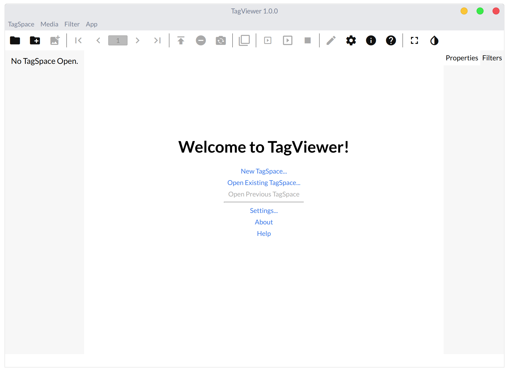

# The Interface

When you open TagViewer for the first time, this is how you'll be greeted:

The row of icons at the top is called the Top Bar. The menus at the top just below the title bar are called the App Menu. The box that says "No TagSpace Open." is the File List. The box with two tabs, Properties and Filters, is the Aside, though it will generally be referred to as the Properties Menu or Filters Menu, which also refer to which tab must be selected to see that menu. The empty white bar at the bottom is called the Status Bar, and holds useful information about the current media \(and of course requires a TagSpace to be open for any content to be shown\).

Now that you've been introduced to the interface, let's get started by taking a look at TagSpaces.

