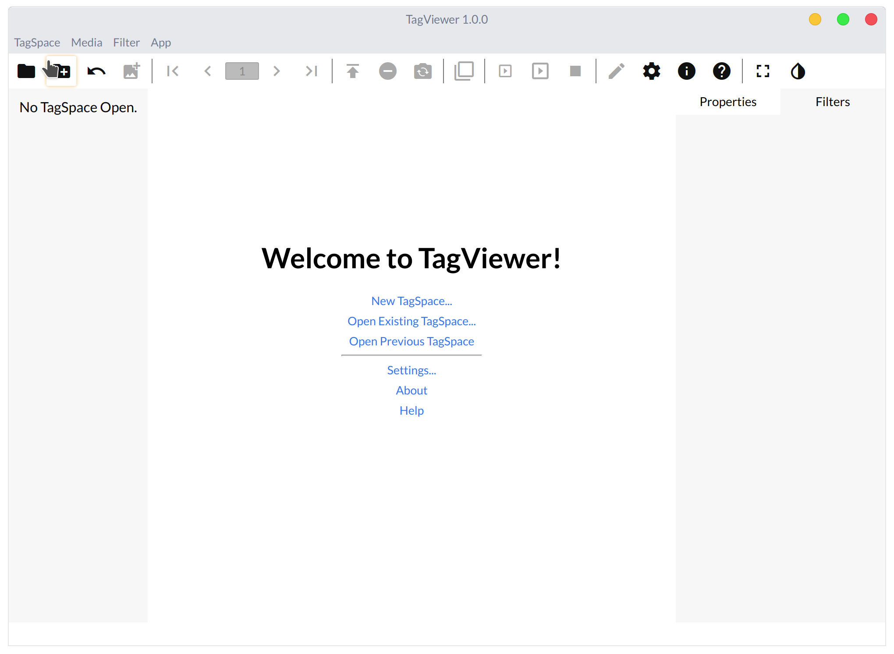
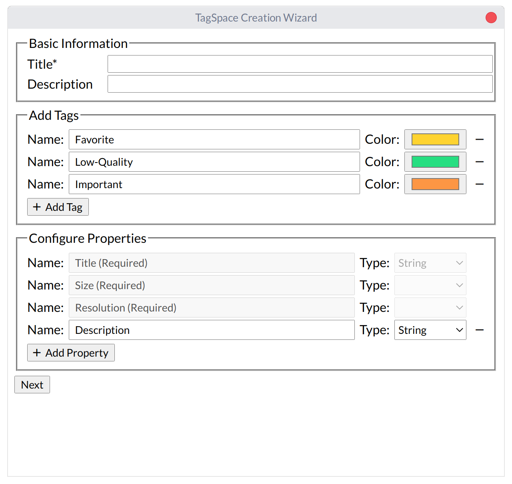

# Creating a TagSpace and Adding Media

Before we begin, please read The Interface from the Beginner's Guide.



Now that you've read that, let's start by making a TagSpace. 

1. Click on the second button in the top bar \(the one that's a folder with a plus\).   
2. Select an empty folder to use as for the TagSpace, or make one. It must not have any contents—if it does, you'll be warned.
3. A dialog will open, where you can set the metadata of the TagSpace, like its title and description, as well as the tags and properties that can be applied to the media in the TagSpace.
4. Add a title and description, and click Next.
5. Select some images from your filesystem to use in this TagSpace, and then click Use \(or whatever the name of the affirmative button is on your operating system\).

You'll now be in that TagSpace.

### Images

