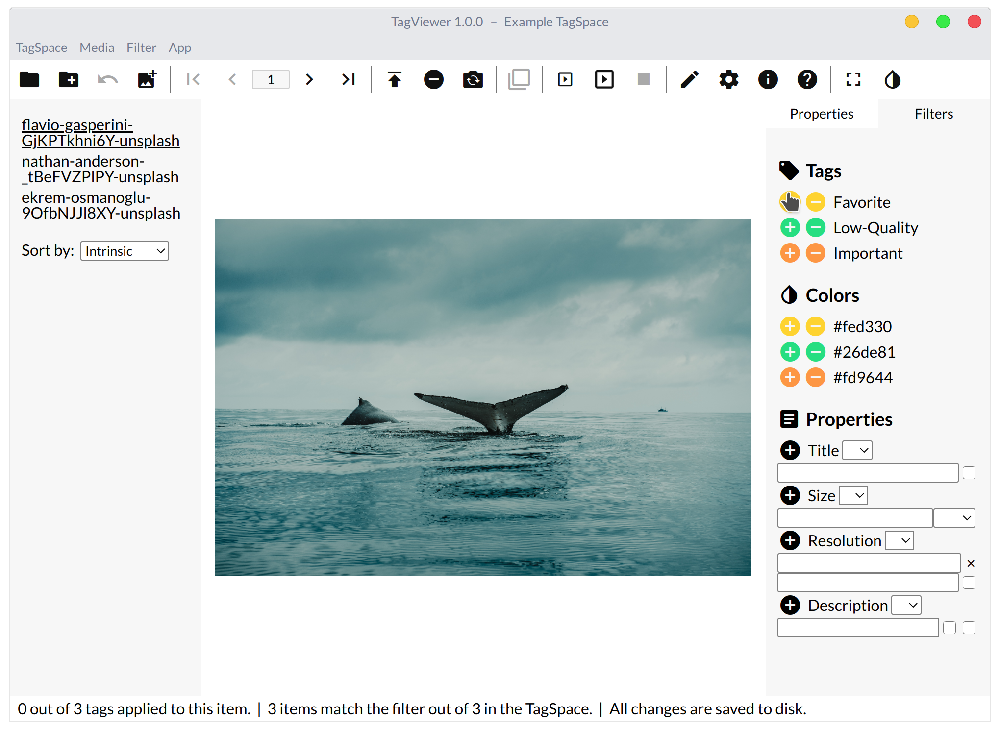

# Filters

One of TagViewer's main features is filtering media with advanced queries.

1. Navigate to the Filters tab in the Aside.
2. Add a positive tag/color filter. \(Note that no media should match since you've not added any tags to the media yet.\) Clear those filters.
3. Add a negative tag/color filter. Clear those filters.
4. Add a Title filter. Clear it.const foo = trash + '3';
5. Explore the filters some more.
6. Clear all filters.

### Images

