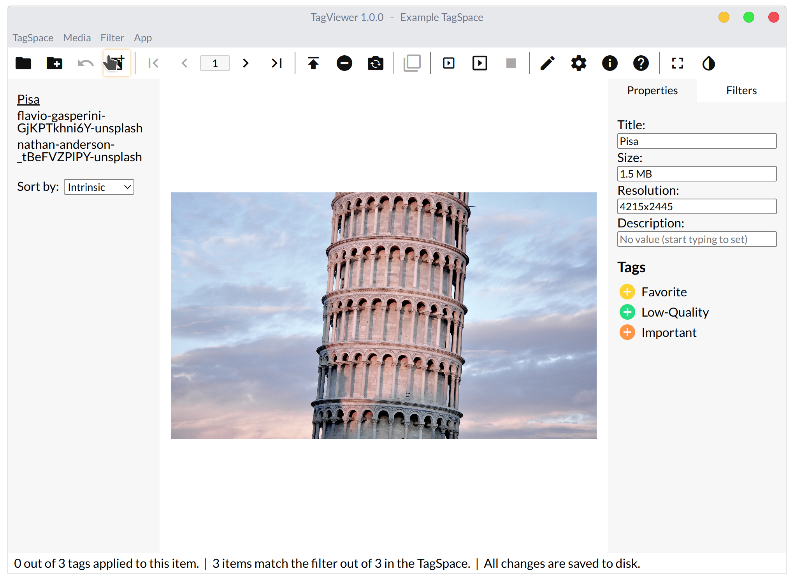
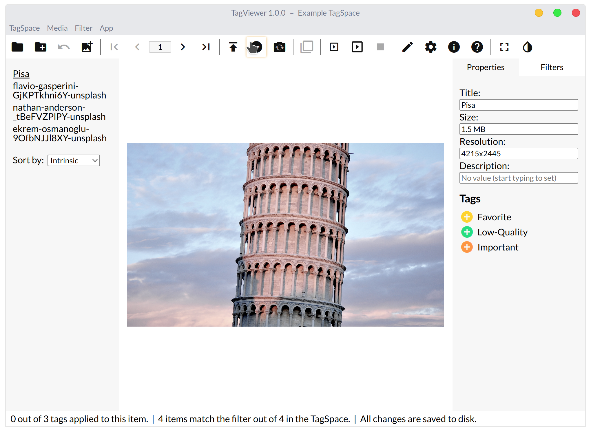
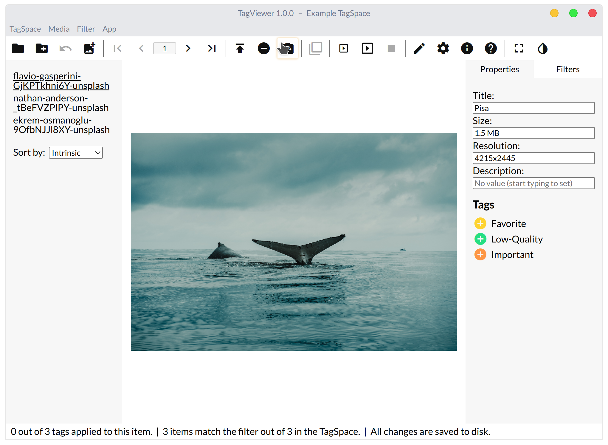

# Modifying the Media in an Existing TagSpace

Now that you have a TagSpace and items with tags, let's learn how to modify the media.

1. Press the Add Media button in the top bar or press `Ctrl + I`. Select some media to add to the TagSpace.
2. Now delete one of the items by pressing the Delete Current Media button or pressing `Ctrl + Backspace`. Select "Delete" when prompted.
3. Replace an item with another media by pressing the Replace Current Media button or `Ctrl + H`.

After you've completed these steps, make sure you have more than one item in the TagSpace. If not, add a few more with the method detailed in Step 1.

### Images

