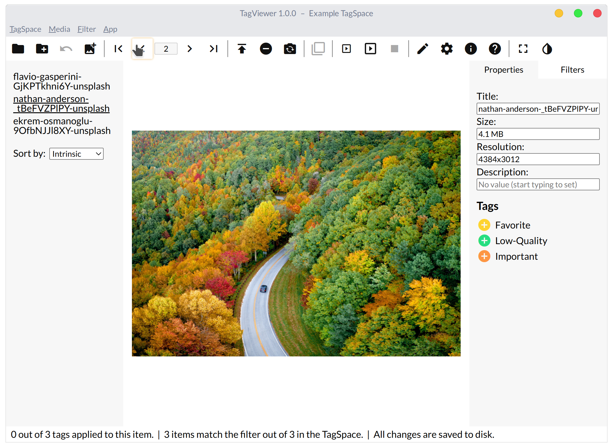
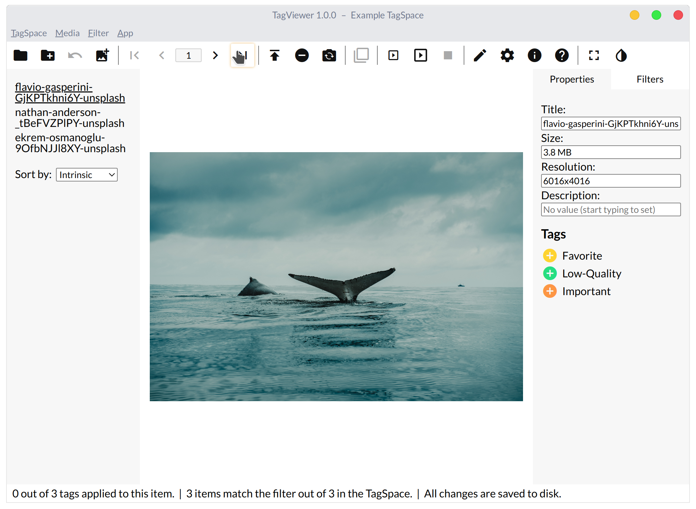
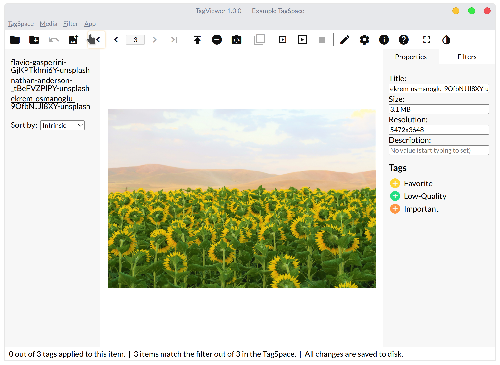
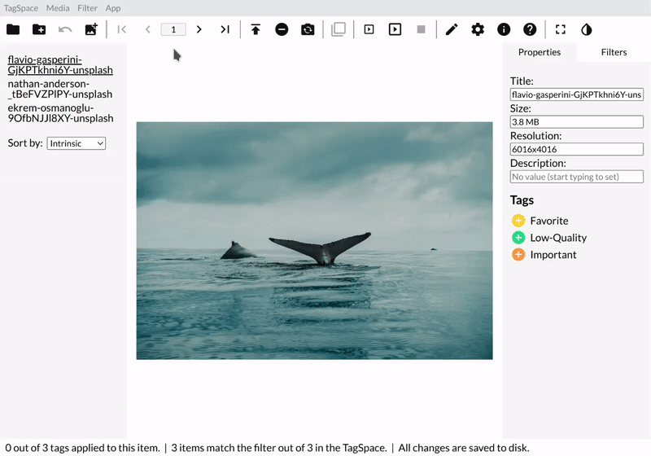
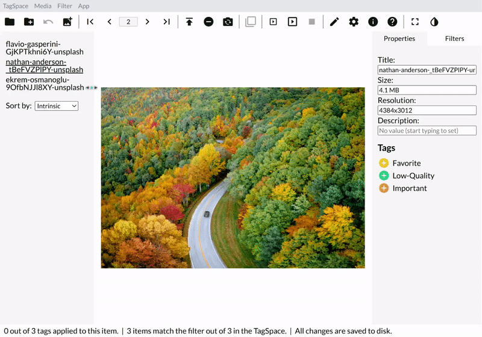

# Navigating Between Items

To see all the media in your TagSpace, you'll need to navigate. At this stage you'll need to have more than one item in your TagSpace.

1. Press the right arrow key or use the button in the top bar immediately to the right of the media number to go to the next media.
2. Press the left arrow key or use the button immediately to the left of the media number to go to the previous media.
3. Press the End key or the button to the right of the Next Media button to go to the last media, and the Home key or the button to the left of the Previous Media button to go to the first media.
4. Enter a media number into the input \(which can be focused with `Ctrl + G`\) in the top bar to directly go to it, and click on an item in the File List to do the same.

Notice how when you change the current media, the number in the Top Bar as well as which item is underlined in the File List change as well.

### Images

