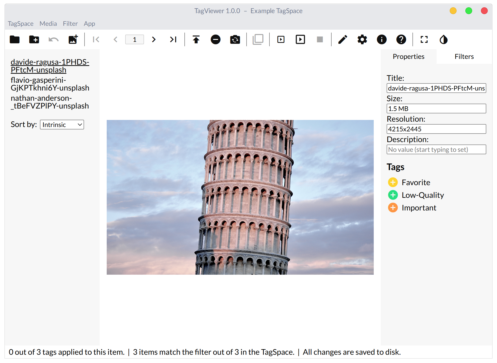
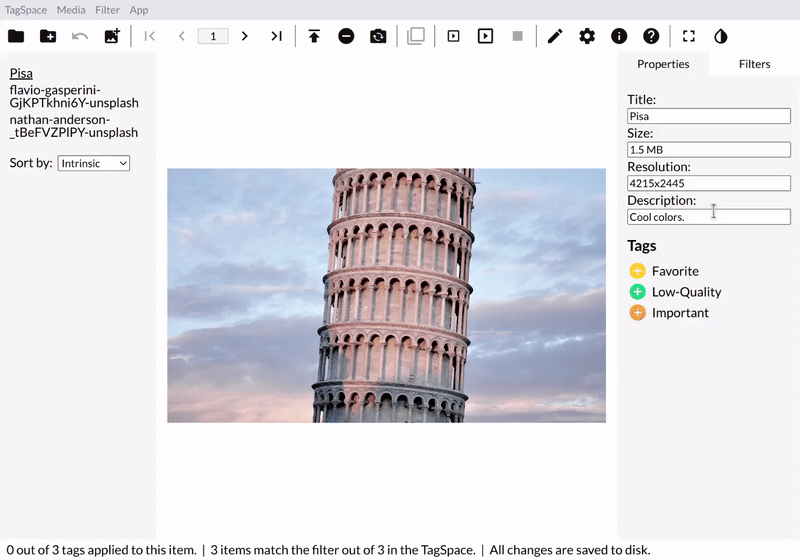

# Settings Tags and Properties

Now that you're in your TagSpace, let's explore tags and properties.

1. Open the Properties tab in the Aside if it's not already opened.
2. Add and remove tags to/from the current media.
3. Set the description and title \(which is by default the name of the file\) of the media.
4. Unset the description.

### Images

